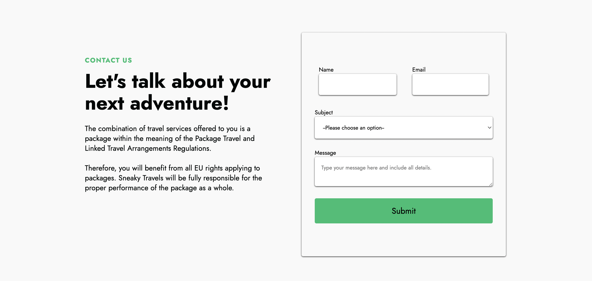

# Sneaky-Travels
Project 2 : Client-Side Single-Page Application Project

# License
[](https://github.com/johnsonr84)
  [](https://github.com/johnsonr84/react-portfolio)
  [](https://github.com/johnsonr84/react-portfolio)
  [](https://choosealicense.com/licenses/mit/)
  [](https://nodejs.org/en/)
  [](https://www.npmjs.com/package/inquirer)


 # Built With
  [](https://reactjs.org/)
   [](https://reactrouter.com/)


# Table of Contents

- [Sneaky-Travels](#sneaky-travels)
- [License](#license)
- [Built With](#built-with)
- [Table of Contents](#table-of-contents)
- [Project Requirements](#project-requirements)
- [Team Approach](#team-approach)
- [Project Description:](#project-description)
- [Installation](#installation)
- [Technologies Used](#technologies-used)
- [Contributors](#contributors)
- [Future Development](#future-development)
- [Questions](#questions)
- [Image Links of this Project:](#image-links-of-this-project)
- [Video Links of this Project:](#video-links-of-this-project)
- [Application GitHub URL:](#application-github-url)
- [Application Deployed live URL:](#application-deployed-live-url)
  
# Project Requirements
Project must fulfill the following requirements:
  * Use React
  * Use Node.js
  * Have both GET and POST routes for retrieving and adding new data.
  * Be deployed using Netlify.
  * Use at least two libraries, packages, or technologies that we haven't discussed.
  * Have a polished front end/UI.
  * Meet good quality coding standards (indentation, scoping, naming).
  * Have a quality README (with unique name, description, technologies used, screenshot, and link to deployed application).

# Team Approach
  * Qasim: 
    * Create frontend development 
    * UI design.
    * polishing
  
  * Farha: 
    * Create backend development 
    * API used: weather_api
    * Netlify deployement

  * Fotios:
    * Create backend development
    * API used: unsplash_api
    * polishing

# Project Description:
  * As a traveler this app will help to find weather forecast and visiting places of particular city.
  * We used two Api's to get data weather_api for weather forecast and unsplash_api for getting images of city.
  * We want to create app when user wants to go some place then firstly he/she can check weather related information and then go through images section also.
  
# Installation
   * To install necessary dependecies, run the following command:
  ```
  npm install
  ```
  * To run build:
  ```
  npm run build
  ```
  * To deploy react app in netlify:
  ```
  npm install netlify-cli -g
  ``` 
  ```
  netlify deploy
  ```  

# Technologies Used
  * HTML
  * CSS
  * JavaScript
  * Bootstrap
  * Node.js
  * React.js
  * API's
  * Netlify

# Contributors
  * Farha Khan 
    * [GitHub](https://github.com/khnfarha1987)
    * [LinkedIn](https://www.linkedin.com/in/farha-khan-b74340208/)
  
  * Qasim M
    * [GitHub](https://github.com/Qasim538)
    * [LinkedIn](https://www.linkedin.com/in/qasim835/)
  
  * Fotios Polymenakos
    * [GitHub](https://github.com/Fot28)

# Future Development
  * Pricing-Section: We want to add package pricing section.
  * Login-Section: We want to create login and save details for user.
  * Map-Section: We want to create city search include map.
  * Payment-Section: We want to create payment section to pay for bookings.
  * Hotel-Section: We want to create hotel section for search for the hotel.

# Questions
If you have any questions about this project, please email our team, or you can find us through github or linkedIn.

# Image Links of this Project:





# Video Links of this Project:


# Application GitHub URL:
[GitHub Link](https://github.com/khnfarha1987/Sneaky-Travels)

# Application Deployed live URL:
[Netlify Deployed Link](https://sneaky-travel.netlify.app/)